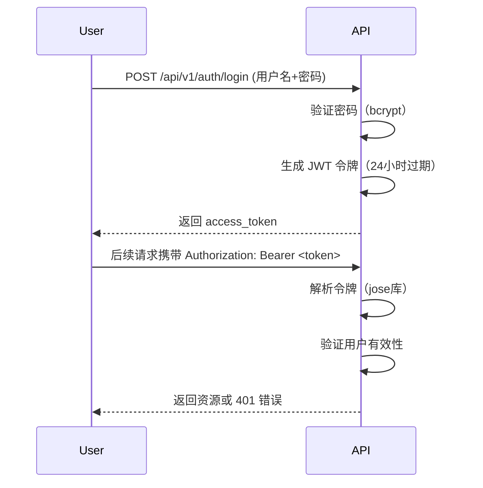
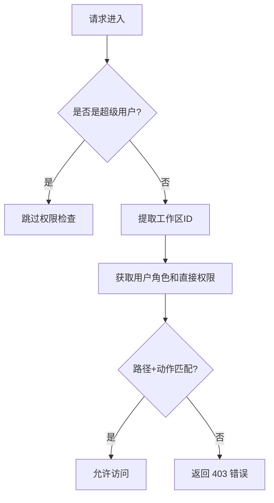

# FastAPI 基础模板 - 认证与权限系统


## 核心特性
- **JWT 认证**：基于 OAuth2 的令牌认证，支持超级用户权限
- **工作区粒度权限**：通过路径（Path）+ 动作（Action）实现细粒度控制
- **角色继承**：默认包含管理员/成员/查看者角色，支持自定义角色权限
- **权限继承**：用户权限 = 角色权限 + 直接分配权限


## 🔐 认证（Auth）系统
### 1. 认证流程


### 2. 关键依赖
```python
# app/auth/dependences.py
async def get_current_user(token: str = Depends(oauth2_scheme), db: AsyncSession = Depends(get_db)):
    """验证 JWT 令牌并获取用户"""

async def get_current_superuser(current_user: User = Depends(get_current_user)):
    """强制要求超级用户权限"""
    if not current_user.is_superuser:
        raise HTTPException(status_code=403, detail="无超级用户权限")
```

### 3. 使用示例
```python
# 需要普通用户认证的路由
@router.get("/profile", response_model=UserResponse)
async def get_profile(current_user: User = Depends(get_current_user)):
    return current_user

# 需要超级用户权限的路由
@router.post("/collections", response_model=CollectionResponse)
async def create_collection(
    collection: CollectionCreate,
    current_user: User = Depends(get_current_superuser),  # 关键依赖
    db: AsyncSession = Depends(get_db),
):
    return await services.create_collection(db, collection)
```


## 🔒 权限（Permission）系统
### 1. 核心概念
| 概念          | 说明                                                                 |
|---------------|----------------------------------------------------------------------|
| **路径（Path）** | 接口路径，支持 `{param}` 占位符和 `/*` 通配符（如 `/workspaces/{id}/*`） |
| **动作（Action）** | 操作类型：`read`/`create`/`update`/`delete`/`*`（通配符）            |
| **角色权限**   | 管理员/成员/查看者默认权限，支持通过 API 动态分配                     |
| **用户权限**   | 直接分配给用户的权限，优先级高于角色权限                             |

### 2. 权限校验流程


#### 角色权限示例
- **administrator**：拥有所有权限
- **member**：目前拥有 `collections` 的创建、修改、查看，但无法删除
- **viewer**：目前只有 `collections` 的查看权限

#### 测试用例
- [x] 创建 `user1`、`user2`、`user3`
- [x] `user1` 创建工作区 1 （`workspace1`），默认会创建 `administrator`、`member`、`viewer`
  - [x] 检查项1：`user1` 可查看 `workspace1` 详情
  - [x] 检查项2：`user2` 无法查看 `workspace1` 详情
- [x] `user1` 在 `workspace1` 创建集合 `collection1`
  - [x] 检查项1：`user1` 可以创建 `collection`
  - [x] 检查项2：`user1` 可以查看 `collections`
  - [x] 检查项3：`user2` 无法查看 `workspace1/collections`，无法创建 `workspace/collections`
- [x] `user1` 邀请 `user2` 以 `member` 角色进入 `workspace1`
  - [x] 检查项1：`user2` 创建/查看/修改 `collections/2`
  - [x] 检查项2：`user2` 无法删除 `collections/2`
  - [x] 检查项3：`user2` 创建 `collections/2/items/1`，`collections/2/items/2`
  - [x] 检查项4：`user2` 无法删除 `collections/2/items/1`
  - [x] 检查项5：`user2` 可以创建 `collections/1/items/1`
- [x] `user1` 邀请 `user3` 以 `viewer` 身份加入，额外分配 `collections/2` 的所有权限
  - [x] 检查项1：`user3` 可以创建 `collections/2/items/3`
  - [x] 检查项2：`user3` 可以删除 `collections/2/items/3`
  - [x] 检查项3：`user3` 无法创建 `collections/1/items/4`

### 3. 关键实现
```python
# 权限校验引擎（app/permissions/engine.py）
class WorkspacePermissionEngine:
    async def check_permission(self, path: str, action: str) -> bool:
        # 1. 超级用户直接通过
        # 2. 解析工作区ID（/workspaces/{id}/...）
        # 3. 合并角色权限和用户直接权限
        # 4. 路径匹配（支持正则和通配符）
        return self._path_matches(request_path, permission_path)

# 路由依赖示例
@router.post("/workspaces/{wid}/items", dependencies=[Depends(require_workspace_permission("/workspaces/{wid}/*", "create"))])
async def create_item(wid: int, ...):
    """需要工作区创建权限"""
```

### 4. 权限分配 API
| 接口路径                                  | 说明                     | 权限要求         |
|-----------------------------------------|--------------------------|------------------|
| `POST /workspaces/{wid}/roles/{rid}/permissions` | 工作区角色权限分配       | 工作区管理员权限 |
| `POST /workspaces/{wid}/users/{uid}/permissions` | 工作区用户权限分配       | 工作区管理员权限 |

**默认角色权限**：
- **管理员**：`/workspaces/{id}/*` 全权限
- **成员**：`read`/`create`/`update`
- **查看者**：仅 `read`


## 🚀 快速开始
1. 安装依赖：
```bash
pip install -r requirements.txt
```

2. 运行服务：
```bash
uvicorn main:app --reload --port 8002
```

3. 测试认证：
```bash
# 登录（默认超级用户：admin/admin）
curl -X POST "http://localhost:8002/api/v1/auth/login" \
  -F "username=admin" -F "password=admin"

# 携带令牌请求
curl -H "Authorization: Bearer <token>" http://localhost:8002/api/v1/collections
```


## 📖 目录结构（关键部分）
```
├── app
│   ├── auth                # 认证模块
│   │   ├── dependences.py  # 认证依赖（JWT/密码校验）
│   │   └── router.py       # 登录接口
│   ├── permissions         # 权限系统
│   │   ├── engine.py       # 核心校验逻辑
│   │   ├── models.py       # 权限数据模型
│   │   └── router.py       # 权限分配接口
│   └── workspace           # 工作区权限
│       ├── services.py     # 权限分配逻辑
│       ├── schemas.py      # 权限数据结构
│       └── router.py       # 带权限校验的路由
└── core
    └── database.py         # 异步数据库配置
```


## 💡 扩展建议
1. **自定义角色**：在 `app/workspace/services.py` 中添加新角色的默认权限
2. **路径匹配优化**：修改 `_path_matches` 方法支持更多通配符规则
3. **权限可视化**：添加 `/api/v1/permissions/me` 接口查看当前用户权限
4. **审计日志**：在权限分配接口添加操作日志记录

> 📌 注意：生产环境请修改 `core/database.py` 中的数据库连接字符串，并替换 `SECRET_KEY`！

如果需要更详细的代码注释或特定功能说明，请随时提出 😊